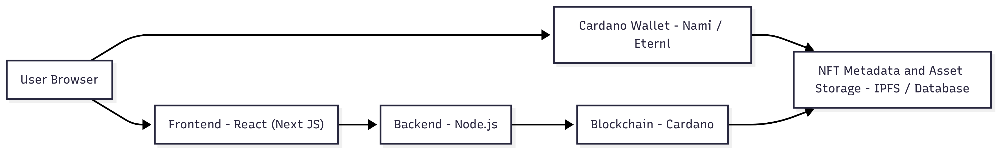

📖 **Digital Library with NFT-Signed Assets**

A decentralized Digital Library where contributors create AI-generated images, sign them with NFTs, and protect ownership rights.
Each contributor’s creativity is tokenized and secured, ensuring exclusive ownership while preventing unauthorized access.

✨ **Features**

🎨 AI-Powered Creativity – Contributors generate images using AI prompts.

🔗 NFT-Signed Assets – Every image is minted as an NFT on the Cardano blockchain.

🔒 Ownership Protection – Contributors cannot access or duplicate others’ digital assets.

🌍 Decentralized Library – Transparent, immutable, and verifiable on-chain records.

📂 Secure Metadata Storage – Assets linked to IPFS/DB with CIP-25 metadata standard.

🏗️ **Tech Stack**

Frontend → Next.js + React + Tailwind CSS

Blockchain → Cardano + MeshJS + Blockfrost API

Smart Contract → Plutus Minting Policy (NFT signing logic)

Storage → IPFS / Database for metadata + assets

Backend → Node.js / FastAPI (API handling)

🔄** Workflow**

🚀** How It Works**

-- Contributor creates an AI prompt → Generates unique image.

-- Image is minted as NFT (using MeshJS + Cardano).

-- Metadata stored via CIP-25 standard (IPFS + Blockchain).

-- Contributor owns signed NFT in their wallet.

-- Digital assets are protected → No cross-access between contributors.

🤝 **Contributors**

-- We welcome all creative contributors to join and showcase their AI + NFT-powered artworks.

-- Submit your AI-generated image

-- Mint via provided DApp

-- Showcase in Digital Library
